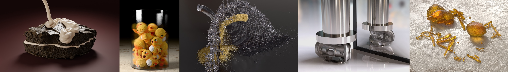
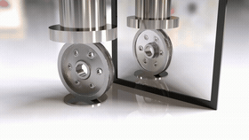
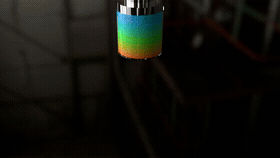
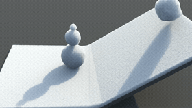

# MPM Lite: Linear Kernels and Integration without Particles

This is the open-source reference implementation of the SIGGRAPH 2026 paper [MPM Lite: Linear Kernels and Integration without Particles](https://mpmlite.github.io/).



## Quick Start

### Dependencies

First clone the repository via git. We use [uv](https://docs.astral.sh/uv/getting-started/installation/) to manage Python packages.

```shell
# install required python packages
uv sync
```

### 3D Demos

| | | |
| --- | --- | --- |
| [](demos/)<br>Run: <code>uv run -m demos.wheel</code> | [](demos/)<br>Run: <code>uv run -m demos.noodles</code> | [](demos/)<br>Run: <code>uv run -m demos.snow</code> |

### 2D Demo

Run a minimal, self-contained single-file 2D example with GUI for a simulation on pure elasticity. Add `-X utf8` for UTF-8 characters compatibility.

```shell
uv add glfw # for GUI
uv run python -X utf8 mpmlite2d.py
```

## Acknowledgements

We acknowledge support from the National Science Foundation under Grants 2153851 and 2301040, the Toyota Research Institute, Sony Corporation, and NVIDIA Corporation.

If you find this repository useful in your project, please cite the following work:

```bibtex
@article{feng2026mpmlite,
  title={MPM Lite: Linear kernels and integration without particles},
  author={Feng, Xiang and Chen, Yunuo and Yu, Chang and Su, Hao and Terzopoulos, Demetri and Yang, Yin and Masterjohn, Joseph and Castro, Alejandro and Jiang, Chenfanfu},
  journal={ACM Trans. Graph.},
  publisher = {Association for Computing Machinery},
  volume = {45},
  number = {4},
  url = {https://doi.org/10.1145/3811294},
  doi = {10.1145/3811294},
  year={2026}
}
```
